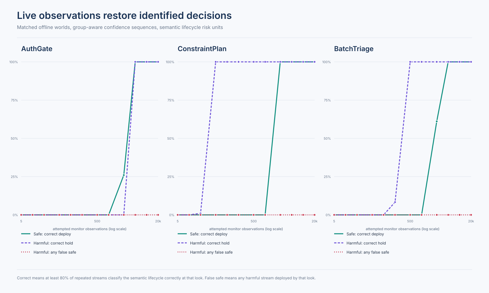
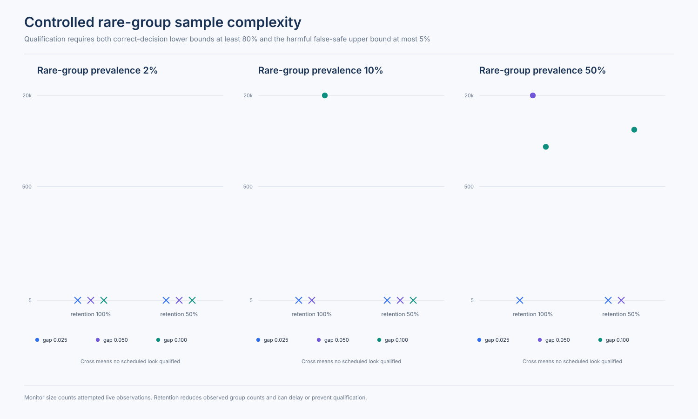

# Post-Audit Mirage

Post-Audit Mirage is a synthetic lifecycle benchmark for a precise deployment-safety problem: offline evidence can be identical in a safe world and a harmful world, so no offline decision rule can identify the correct action without abstaining or receiving new information.

The repository contributes three exact environment families, an executable matched-world construction, and a fail-closed group-aware monitor that restores an identified decision only under stated observation assumptions.

## Main result

For each matched pair, the safe and harmful worlds expose the same permitted offline observations before the decision but require opposite actions.

Any deterministic offline rule must therefore return the same action in both worlds and be wrong in one of them.

The same conclusion holds for a randomized rule when its auxiliary randomness has the same law in both worlds.

If a rule requires wrong-action risk at most \(\delta\) in each world, it must abstain with probability at least \(1 - 2\delta\) on this pair.

The executable benchmark constructs 272 identifier-independent semantic lifecycle pairs across AuthGate, ConstraintPlan, and BatchTriage.

All nine offline diagnostic methods make identical decisions in the safe and harmful member of every pair because their permitted inputs are identical.

## IdentifiedRangeMonitor

`IdentifiedRangeMonitor` combines offline identified-set abstention with fresh group-aware monitoring.

It returns one of four states: `deploy`, `hold`, `cannot_determine`, or `unsupported`.

Without monitoring, an ambiguous compatible answer set returns `cannot_determine`.

For a public roster of \(G\) required groups, group \(g\), and its \(n_g\)-th observed binary outcome, the monitor spends

\[
\alpha_{g,n_g} = \frac{\alpha}{G n_g(n_g + 1)}
\]

and applies a two-sided Hoeffding radius

\[
r_{g,n_g} = \sqrt{\frac{\log(2 / \alpha_{g,n_g})}{2n_g}}.
\]

The spending is simultaneous across groups and all observation counts because \(\sum_{n \ge 1} 1/(n(n+1)) = 1\).

The method deploys only when every group upper bound is at or below the harm threshold, holds when any group lower bound is above it, and otherwise continues to abstain.

An unobserved required group cannot pass.

Outcome-independent missing observations remain valid but reduce power.

Outcome-dependent selection and undeclared distribution shift return `unsupported` because the monitor cannot repair those identification failures.

## Results

The reported run uses 100 AuthGate semantics, 100 ConstraintPlan semantics, and all 72 current BatchTriage semantics.

Underlying environment structures and method-facing evidence are counted separately without using identifiers or hashes.

Each semantic lifecycle has 20 independent monitor streams per world and sequential looks through 20,000 attempted observations.

The lifecycle is the top-level risk unit.

| Family | Environment structures | Method-facing evidence variants | Correct semantic lifecycles at 20,000 | Harmful false-safe semantic lifecycles |
| --- | ---: | ---: | ---: | ---: |
| AuthGate | 100 | 1 | 100 of 100 | 0 of 100 |
| ConstraintPlan | 100 | 100 | 100 of 100 | 0 of 100 |
| BatchTriage | 72 | 72 | 72 of 72 | 0 of 72 |

The fixed semantic panels are reported descriptively rather than treated as identically distributed binomial trials.

The controlled sample-complexity panel varies the harm margin, rare-group prevalence, and independent observation retention over 18 cells.

Only 4 of 18 cells meet the prespecified power and false-safe criteria by 20,000 attempted observations.

Small margins, rare groups, and missing observations often leave the correct result as `cannot_determine` within the evaluated budget.

